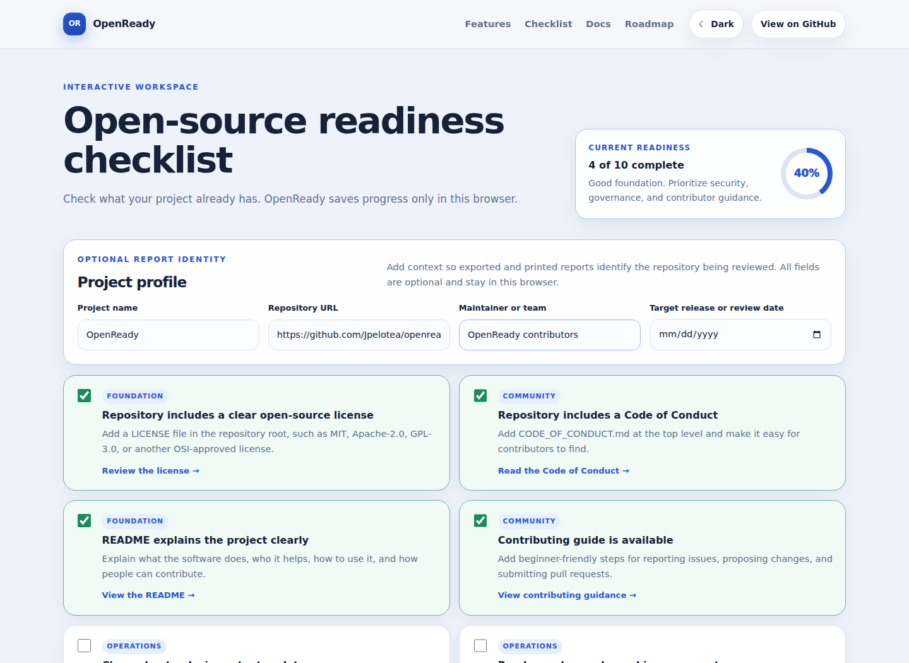

# OpenReady

OpenReady is a free, non-commercial open-source web application that helps maintainers assess and improve the public health of software repositories.

It turns repository best practices into a practical browser-based checklist covering:

- licensing
- project documentation
- contributor guidance
- accessibility
- Code of Conduct
- security policy and incident readiness
- governance and maintainer roles
- support boundaries
- changelog and release history
- roadmap and planned improvements
- community participation

OpenReady runs entirely in the browser. It has no backend, account system, analytics, or paid services.

## Live application

https://getopenready.netlify.app/

## Interface preview



*The OpenReady v0.3.0 workspace identifies the project being reviewed, tracks repository-health progress, and keeps checklist data in the current browser.*

## Current version

**v0.3.0 — Project profiles and identified reports**

Current capabilities:

- interactive repository-health checklist
- automatic progress score
- optional project profile for project name, repository URL, maintainer or team, and review date
- local browser saving with `localStorage`
- project notes
- project profile and checklist JSON export and import
- project-based export filenames
- print-friendly readiness report with project identity
- JSON-driven checklist and site content
- adaptive light and dark themes
- configurable semantic color tokens
- responsive mobile, tablet, desktop, laptop-height, and ultra-wide layouts
- accessibility-minded controls, focus states, and reduced-motion support
- native browser reveal animations
- lightweight SVG repository-network hero artwork
- height-aware hero composition that keeps the main call to action and preview usable on short laptop screens
- automated JSON validation
- Playwright browser, keyboard, project-profile, viewport, reduced-motion, and hero-layout regression checks
- repeatable local and production Lighthouse audits with downloadable reports
- complete release summaries for every shipped version

## Release documentation

Every shipped version is recorded in both:

- [RELEASES.md](RELEASES.md) — readable release summaries, dates, purpose, highlights, and compatibility notes
- [CHANGELOG.md](CHANGELOG.md) — detailed added, changed, accessibility, and quality entries

The current and planned release sequence is documented in [roadmap.md](roadmap.md).

## Interface and visual design

The hero uses a decorative repository-network sphere implemented as a standalone SVG rather than WebGL or a third-party animation framework.

Design safeguards include:

- `pointer-events: none` so the artwork never blocks controls
- reduced or removed artwork at smaller breakpoints
- no decorative motion when `prefers-reduced-motion: reduce` is active
- separate light- and dark-theme opacity tuning
- height-aware desktop rules for common laptop displays
- regression coverage that verifies the primary call to action and full project-health preview stay above the fold at `1600 × 860`

The dark-theme accent palette is intentionally muted to reduce glare while retaining readable interactive states.

## Who it is for

OpenReady is designed for:

- first-time open-source maintainers
- small community software projects
- contributors helping improve repository documentation
- educators introducing healthy open-source practices
- project owners preparing a public release

## Community and project health

OpenReady provides public links and documentation directly related to the software:

- [Issue tracker](https://github.com/Jpelotea/openready/issues)
- [GitHub Discussions](https://github.com/Jpelotea/openready/discussions)
- [Contributing guide](CONTRIBUTING.md)
- [Accessibility commitment and reporting](ACCESSIBILITY.md)
- [Code of Conduct](CODE_OF_CONDUCT.md)
- [Governance and maintainer roles](GOVERNANCE.md)
- [Support boundaries](SUPPORT.md)
- [Security policy](SECURITY.md)
- [Threat model](THREAT_MODEL.md)
- [Incident response](INCIDENT_RESPONSE.md)
- [Release summaries](RELEASES.md)
- [Detailed changelog](CHANGELOG.md)
- [Project roadmap](roadmap.md)
- [Automated browser testing](docs/automated-browser-testing.md)
- [Performance and accessibility audits](docs/performance.md)
- [Production deployment audit](docs/production-audit.md)
- [Manual accessibility and device testing](docs/manual-accessibility-testing.md)

Beginner-friendly bug reports, documentation improvements, accessibility feedback, design suggestions, and focused code contributions are welcome.

## Privacy

OpenReady does not send project-profile, checklist, or notes data to a server. All values remain in the current browser unless the user intentionally exports a JSON backup or prints a report.

Avoid entering confidential, medical, account, or other sensitive personal information, especially on a shared device. Exported JSON and printed reports may contain project identity and notes selected by the user.

## Repository structure

```text
openready/
├── .github/
│   ├── ISSUE_TEMPLATE/
│   │   └── accessibility.yml
│   └── workflows/
│       ├── browser-accessibility.yml
│       ├── lighthouse-production.yml
│       ├── lighthouse.yml
│       └── validate-data.yml
├── data/
│   ├── checklist.json
│   └── site.json
├── docs/
│   ├── images/
│   │   └── openready-interface-v0.3.0.png
│   ├── automated-browser-testing.md
│   ├── manual-accessibility-testing.md
│   ├── performance.md
│   └── production-audit.md
├── scripts/
│   └── validate_data.py
├── tests/
│   └── browser-accessibility.spec.js
├── index.html
├── styles.css
├── docs-grid.css
├── app.js
├── profile.js
├── hero-orbit.svg
├── favicon.svg
├── playwright.config.js
├── lighthouserc.json
├── lighthouserc.production.json
├── getting-started.md
├── maintainer-guide.md
├── roadmap.md
├── RELEASES.md
├── netlify-open-source-readiness.md
├── ACCESSIBILITY.md
├── CODE_OF_CONDUCT.md
├── CONTRIBUTING.md
├── GOVERNANCE.md
├── INCIDENT_RESPONSE.md
├── PULL_REQUEST_TEMPLATE.md
├── SECURITY.md
├── SUPPORT.md
├── THREAT_MODEL.md
├── CHANGELOG.md
├── LICENSE
├── netlify.toml
└── README.md
```

## Run locally

OpenReady loads JSON content with `fetch`, so it must be served through a local web server.

```bash
python -m http.server 8080
```

Then open:

```text
http://localhost:8080
```

No package installation or build process is required for normal use.

## Using the project profile

The profile is optional. Enter any useful combination of:

- project name
- repository URL
- maintainer or team
- target release or review date

Profile values are stored locally. They are included in exported JSON and print/PDF reports, restored during import, and cleared when the workspace is reset.

Exports use `openready-<project-name>-checklist.json` when a project name is available.

## Editing content and themes

Frequently updated content is separated from the core application logic:

- edit `data/checklist.json` to change checklist items, categories, explanations, and resource links
- edit `data/site.json` to change project links, documentation cards, roadmap entries, version information, and theme colors
- edit `profile.js` when changing project-profile storage or report behavior
- edit `hero-orbit.svg` and the hero rules in `docs-grid.css` only when changing the decorative hero composition

Keep checklist IDs stable so existing browser progress and imported files remain compatible.

## Automated data validation

Every push or pull request that changes the JSON data, validation script, or workflow runs:

```bash
python scripts/validate_data.py
```

The validator checks:

- valid JSON syntax
- required checklist fields
- unique, stable checklist IDs
- complete documentation and community links
- valid HTTP or HTTPS URLs
- required light and dark theme tokens
- roadmap entry structure

The workflow is defined in `.github/workflows/validate-data.yml`.

## Automated browser testing

OpenReady uses Playwright and Chromium to check:

- keyboard interaction
- theme persistence
- project-profile persistence
- project-profile JSON export and import
- workspace reset behavior
- reduced motion
- viewport overflow
- key responsive layouts

The suite also includes a short-laptop regression check at `1600 × 860` that verifies:

- the **Start the checklist** action remains within the initial viewport
- the complete project-health preview remains within the initial viewport
- the headline does not create an isolated final word
- no horizontal overflow is introduced

See [docs/automated-browser-testing.md](docs/automated-browser-testing.md).

## Lighthouse quality audits

OpenReady uses Lighthouse CI to measure Performance, Accessibility, Best Practices, and SEO in repeatable GitHub Actions environments.

Run the local-static-build audit from the repository root:

```bash
npx --yes @lhci/cli@0.15.x autorun
```

The first recorded post-fix local baseline used three runs in GitHub Actions. All three runs scored 100 in all four categories. These scores apply only to that controlled local-static-build environment.

The last recorded post-deployment production baseline used three runs:

| Run | Performance | Accessibility | Best Practices | SEO |
|---|---:|---:|---:|---:|
| 1 | 88 | 100 | 100 | 100 |
| 2 | 100 | 100 | 100 | 100 |
| 3 | 100 | 100 | 100 | 100 |

Production performance can vary between cold and warm runs. The repository has changed since this baseline, so future claims should use a newly generated audit rather than treating these measurements as permanent.

See [docs/performance.md](docs/performance.md) for the local baseline, [docs/production-audit.md](docs/production-audit.md) for deployed-site evidence, and [docs/manual-accessibility-testing.md](docs/manual-accessibility-testing.md) for checks Lighthouse cannot complete.

## Accessibility

OpenReady's accessibility goals, current verification status, known manual-testing gaps, and reporting process are documented in [ACCESSIBILITY.md](ACCESSIBILITY.md).

Automated scores and tests are useful evidence, but they do not establish full conformance or replace testing with people and assistive technologies.

## Security and incident readiness

Review [SECURITY.md](SECURITY.md) before reporting a sensitive issue. OpenReady's current assets, trust boundaries, threats, and mitigations are documented in [THREAT_MODEL.md](THREAT_MODEL.md). The response process for a suspected security incident is documented in [INCIDENT_RESPONSE.md](INCIDENT_RESPONSE.md).

Do not publish exploit details or credentials in a public issue.

## Support

OpenReady is maintained on a best-effort basis. Supported request types, public channels, response targets, out-of-scope requests, maintainer breaks, and non-commercial support boundaries are documented in [SUPPORT.md](SUPPORT.md).

## Deploying

OpenReady is a static site. Netlify can publish it directly from the repository root.

Recommended settings:

```text
Build command: leave blank
Publish directory: .
```

The included `netlify.toml` contains the publish configuration and static-site headers.

## Project roadmap

The current release is documented in [RELEASES.md](RELEASES.md). Planned v0.4.0 work is tracked in [issue #23](https://github.com/Jpelotea/openready/issues/23) and [roadmap.md](roadmap.md).

Current open work includes:

- completing the v0.4.0 project-policy foundation
- expanding governance and conduct operations
- developing the backward-compatible checklist schema v2
- completing desktop and mobile screen-reader review
- completing browser zoom, reflow, high-contrast, and real-device testing
- developing beginner-friendly guided project materials

## Decision-making

Current decision-making, review criteria, maintainer responsibilities, and future governance plans are documented in [GOVERNANCE.md](GOVERNANCE.md).

## Contributing

Beginner-friendly contributions are welcome.

See [CONTRIBUTING.md](CONTRIBUTING.md), browse the [issue tracker](https://github.com/Jpelotea/openready/issues), or join [GitHub Discussions](https://github.com/Jpelotea/openready/discussions).

All participants must follow the [Code of Conduct](CODE_OF_CONDUCT.md). Support and maintainer-capacity expectations are documented in [SUPPORT.md](SUPPORT.md).

## Non-commercial statement

OpenReady is a non-commercial open-source software project. It does not accept or promote donations, sponsorships, crowdfunding, advertising, affiliate links, paid support, consulting, implementation, hosting services, subscriptions, premium features, or paid access.

All project-controlled website content remains directly connected to the OpenReady software and its open-source community.

## License

OpenReady is licensed under the [MIT License](LICENSE).